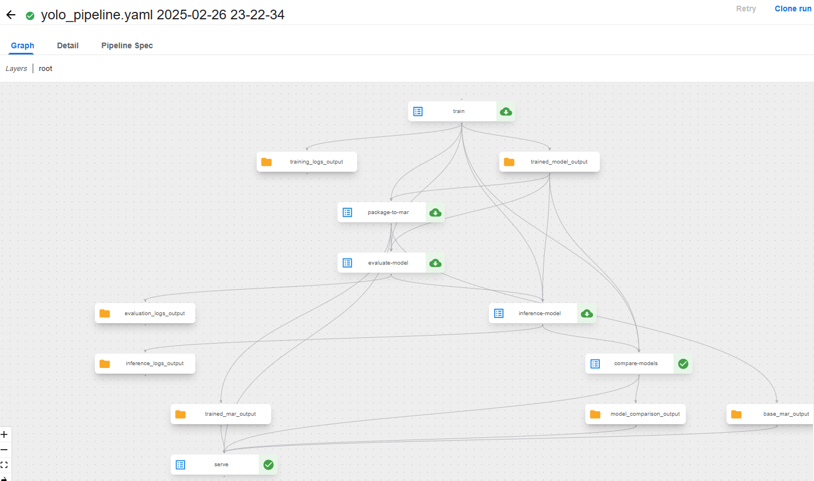

# Manual Setup

## install k3s
```bash
curl -sfL https://get.k3s.io | sh -
```

## Prepare kubeconfig
```bash
export KUBECONFIG=/etc/rancher/k3s/k3s.yaml
sudo chmod 644 /etc/rancher/k3s/k3s.yaml
```
## cert-manager
```bash
cd ~/manifests/common/cert-manager/base 
kubectl kustomize . | kubectl apply -f -
```

## kubeflow-issuer
```bash
cd ~/manifests/common/cert-manager/kubeflow-issuer/base
kubectl kustomize . | kubectl apply -f -
```

## istio
```bash
cd ~/manifests/common/istio-1-23/istio-crds/base 
kubectl kustomize . | kubectl apply -f -

cd ~/manifests/common/istio-1-23/istio-namespace/base
kubectl kustomize . | kubectl apply -f -

cd ~/manifests/common/istio-1-23/istio-install/overlays/oauth2-proxy
kubectl kustomize . | kubectl apply -f -
```
## oauth2-proxy
```bash
cd ~/manifests/common/oauth2-proxy/overlays/m2m-dex-and-kind
kubectl kustomize . | kubectl apply -f -
```

## dex
```bash
cd ~/manifests/common/dex/overlays/oauth2-proxy
kubectl kustomize . | kubectl apply -f -
```
## kubeflow-namespace
```bash
cd ~/manifests/common/kubeflow-namespace/base
kubectl kustomize . | kubectl apply -f -
```

## networkpolicies
```bash
cd ~/manifests/common/networkpolicies/base 
kubectl kustomize . | kubectl apply -f -
```

## kubeflow-roles
```bash
cd ~/manifests/common/kubeflow-roles/base
kubectl kustomize . | kubectl apply -f -
```

## kubeflow-istio-resources
```bash
cd ~/manifests/common/istio-1-23/kubeflow-istio-resources/base
kubectl kustomize . | kubectl apply -f -
```

## apps/centraldashboard
```bash
cd ~/manifests/apps/centraldashboard/overlays/oauth2-proxy
kubectl kustomize . | kubectl apply -f -
```

## profiles + kfam
```bash
cd ~/manifests/apps/profiles/upstream/overlays/kubeflow
kubectl kustomize . | kubectl apply -f -
```

## user-namespace
```bash
cd ~/manifests/common/user-namespace/base
kubectl kustomize . | kubectl apply -f -
```
```bash
kubectl patch svc istio-ingressgateway -n istio-system \
  -p '{"spec": {"type": "NodePort"}}'
```
```bash
kubectl port-forward svc/istio-ingressgateway -n istio-system 8080:80
```

# NOTEBOOKS

## notebooks 
```bash
cd ~/manifests/apps/jupyter/notebook-controller/upstream/overlays/kubeflow
kubectl kustomize . | kubectl apply -f -
```

## jupyter webapp
```bash
cd ~/manifests/apps/jupyter/jupyter-web-app/upstream/overlays/istio
kubectl kustomize . | kubectl apply -f -
```

## pvc viewer-controller
```bash
cd ~/manifests/apps/pvcviewer-controller/upstream/base
kubectl kustomize . | kubectl apply -f -
```

## volumes webapp
```bash
cd ~/manifests/apps/volumes-web-app/upstream/overlays/istio
kubectl kustomize . | kubectl apply -f -
```

## admission-webhook
```bash
cd ~/manifests/apps/admission-webhook/upstream/overlays/cert-manager
kubectl kustomize . | kubectl apply -f -
```

# NOTEBOOKS DONE

# https

## create file
```bash
touch ~/https/cluster-issuer.yaml
```

```yaml
apiVersion: cert-manager.io/v1
kind: ClusterIssuer
metadata:
  name: selfsigned-cluster-issuer
spec:
  selfSigned: {}
```

```bash
kubectl apply -f cluster-issuer.yaml

sudo mkdir -p /etc/ssl/certs/kubeflow

sudo openssl req -x509 -nodes -days 365 -newkey rsa:2048 \
  -keyout /etc/ssl/certs/kubeflow/kubeflow.key \
  -out /etc/ssl/certs/kubeflow/kubeflow.crt \
  -subj "/CN=kubeflow.local"

sudo kubectl create secret tls kubeflow-tls \
  --cert=/etc/ssl/certs/kubeflow/kubeflow.crt \
  --key=/etc/ssl/certs/kubeflow/kubeflow.key \
  -n istio-system
```

```bash
kubectl edit gateway kubeflow-gateway -n kubeflow
```

```yaml
# Add section:
  - hosts:
    - '*' 
    port:
      name: https
      number: 443
      protocol: HTTPS
    tls:
      mode: SIMPLE
      credentialName: kubeflow-tls
```
## create file
```bash
~/https/kubeflow-certificate.yaml
```

```yaml
apiVersion: cert-manager.io/v1
kind: Certificate
metadata:
  name: kubeflow-tls
  namespace: istio-system
spec:
  secretName: kubeflow-tls
  duration: 4320h
  renewBefore: 720h 
  issuerRef:
    name: selfsigned-cluster-issuer
    kind: ClusterIssuer
  dnsNames:
  - kubeflow.local
```
```bash
kubectl apply -f cluster-issuer.yaml

kubectl apply -f kubeflow-certificate.yaml

kubectl port-forward svc/istio-ingressgateway -n istio-system 8443:443

kubectl get svc istio-ingressgateway -n istio-system
```

# Machine Learning apps
## tensorboard web app
```bash
cd ~/manifests/apps/tensorboard/tensorboards-web-app/upstream/overlays/istio
kubectl kustomize . | kubectl apply -f -
```

## tensorboard controller
```bash
cd ~/manifests/apps/tensorboard/tensorboard-controller/upstream/overlays/kubeflow
kubectl kustomize . | kubectl apply -f -
```

## katib
```bash
cd ~/manifests/apps/katib/upstream/installs/katib-with-kubeflow
kubectl kustomize . | kubectl apply -f -
```

# kubeflow-pipelines second attempt

## crd
```bash
cd ~/manifests/apps/pipeline/upstream/env/cert-manager/cluster-scoped-resources
kubectl kustomize . | kubectl apply -f -
```

## pipelines
```bash
cd ~/manifests/apps/pipeline/upstream/env/cert-manager/platform-agnostic-multi-user
kubectl kustomize . | kubectl apply -f -
```

### fix metadata issue in pipelines
```bash
kubectl edit deployment ml-pipeline-ui -n kubeflow
```

```yaml
   - env:
        - name: DISABLE_GKE_METADATA
          value: "true"
        - name: ARGO_ARCHIVE_LOGS
          value: "true"
        - name: VIEWER_TENSORBOARD_POD_TEMPLATE_SPEC_PATH
          value: /etc/config/viewer-pod-template.json
        - name: DEPLOYMENT
          value: KUBEFLOW
```

```bash
kubectl rollout restart deployment ml-pipeline-ui -n kubeflow
```

## knative-serving

```bash
cd ~/manifests/common/knative/knative-serving/overlays/gateways
kubectl kustomize . | kubectl apply -f -
```

```bash
cd ~/manifests/common/istio-1-23/cluster-local-gateway/base
kubectl kustomize . | kubectl apply -f -
```

## knative-eventing
```bash
kubectl apply --filename https://github.com/knative/eventing/releases/download/knative-v1.16.1/eventing-crds.yaml
kubectl apply --filename https://github.com/knative/eventing/releases/download/knative-v1.16.1/eventing-core.yaml
```

## kserve
```bash
cd ~/manifests/contrib/kserve/kserve
kubectl kustomize . | kubectl apply --server-side --force-conflicts -f -
```

```bash
cd ~/manifests/contrib/kserve/models-web-app/overlays/kubeflow
kubectl kustomize . | kubectl apply -f -
```

## training-operator
```bash
cd ~/manifests/apps/training-operator/upstream/overlays/kubeflow 
kubectl kustomize . | kubectl apply -f -
```

## access minio
```bash
kubectl get secret mlpipeline-minio-artifact -n kubeflow -o jsonpath="{.data.secretkey}" | base64 --decode
minio123
kubectl get secret mlpipeline-minio-artifact -n kubeflow -o jsonpath="{.data.accesskey}" | base64 --decode
minio
```
```bash
kubectl port-forward -n kubeflow svc/minio-service 9000:9000
```

## pipeline
```bash
kubectl apply -f poddefault.yaml -n kubeflow-user-example-com
```



## test model
### prepare config.properties to minIO
```properties
inference_address=http://0.0.0.0:8085
management_address=http://0.0.0.0:8085
metrics_address=http://0.0.0.0:8082
grpc_inference_port=7070
grpc_management_port=7071
enable_metrics_api=true
metrics_format=prometheus
job_queue_size=100
enable_envvars_config=true
install_py_dep_per_model=true
model_store=/mnt/models/model-store
default_response_timeout=600
service_envelope=kserve
model_snapshot={"name":"startup.cfg","modelCount":1,"models":{"yolo_model":{"1.0":{"defaultVersion":true,"marName":"yolo_model.mar","minWorkers":1,"maxWorkers":5,"batchSize":1,"maxBatchDelay":100,"responseTimeout":600}}}}
```
```bash
kubectl apply -f inferenceservice.yaml
```
```bash
kubectl get pods -n kubeflow-user-example-com -l serving.kserve.io/inferenceservice=yolov8
```
```bash
kubectl port-forward -n kubeflow-user-example-com yolov8-predictor-00001-deployment-7684949674-qdmtc 8080:8080 8095:8085
```
```bash
curl -X POST http://localhost:8080/v1/models/yolo_model:predict \
  -H "Content-Type: application/json" \
  -d '{
    "inputs": [
      {
        "name": "input0",
        "shape": [1],
        "datatype": "BYTES",
        "data": ["'"$(base64 -w 0 zidane.jpg)"'"]
      }
    ]
  }'
```

# cheatsheet

## uninstall k3s
```bash
sudo /usr/local/bin/k3s-uninstall.sh
```
```bash
sudo rm -rf /var/lib/rancher
sudo rm -rf /etc/rancher
```
### to get platform HTTPS port
``bash
kubectl patch svc istio-ingressgateway -n istio-system \
  -p '{"spec": {"type": "NodePort"}}'

kubectl get svc istio-ingressgateway -n istio-system -o yaml
```
## Setup check commands 
```bash
kubectl get svc istio-ingressgateway -n istio-system -o yaml
curl -v http://10.42.0.22:8081/kfam
kubectl logs -n kubeflow deployment/profiles-deployment
kubectl get svc -n kubeflow profiles-kfam
kubectl describe pod oauth2-proxy-75cc8f8677-j8jkg -n oauth2-proxy
kubectl logs -n auth -l app=dex
kubectl logs -n oauth2-proxy -l app.kubernetes.io/name=oauth2-proxy
kubectl logs -n kubeflow -l app=centraldashboard
kubectl get pods -A
```
